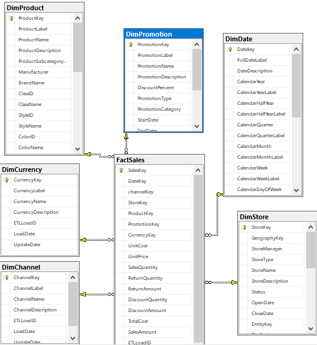
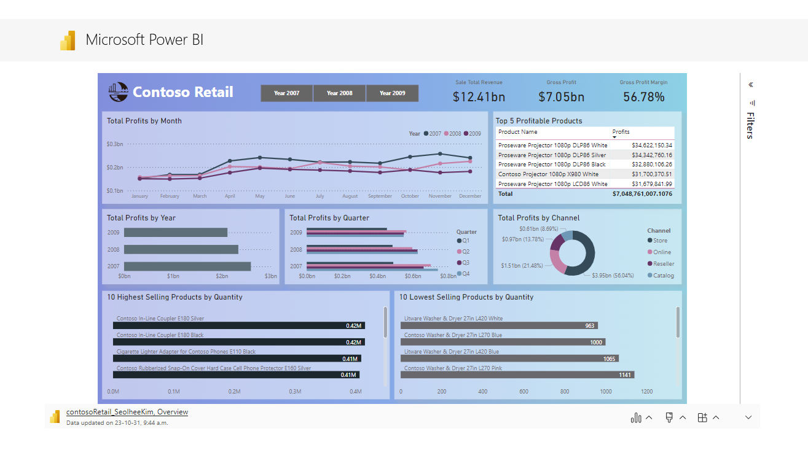

# Retail Sales Performance Dashboard – Contoso Retail

This project simulates a real-world engagement with **Contoso Retail**, a global electronics retailer. I was brought on as a data analyst to develop a dynamic reporting solution in Power BI to support executive decision-making.

Using the **ContosoRetailDW** data warehouse (sample data), I built a complete BI solution from data modeling to final dashboard delivery.

---

## Project Brief

Contoso’s leadership needed a clear, data-driven view of retail performance across years, channels, and product lines. They wanted a system that could answer:

- Which products are the most and least profitable?
- Which sales channels drive the highest returns?
- Which product and channel combinations should be prioritized?
- How have sales and profits trended across time?

I proposed, designed, and delivered a Power BI dashboard with a strong semantic model that allowed for slicing, drill-down, and exploratory analysis — all built on top of a structured SQL data warehouse.

---

## Tools & Technologies

- SQL Server (ContosoRetailDW)
- Power BI Desktop
- DAX, Power Query (M)
- Star Schema Data Modeling
- Visual & Analytical Reporting

---

## Data Model

The Power BI model follows a **clean star schema**. I performed schema review and designed relationships for scalable performance.

- Central Fact Table: `FactSales`
- Dimension Tables:
  - `DimProduct`
  - `DimDate`
  - `DimPromotion`
  - `DimCurrency`
  - `DimChannel`
  - `DimStore`

---

## Executive Dashboard Overview

The final dashboard allows executives to:
- Compare **profitability over time** (by year, quarter, month)
- Identify **top/bottom products** by quantity and revenue
- Explore **channel profitability**
- Interact with filters and dynamic slicers

---

## Strategic Insights & Recommendations

Based on the analysis, I presented the following key takeaways to stakeholders:

- **Online and Catalog channels** drive over 70% of profit — continued investment is recommended.
- High-margin products like **Proseware projectors** should be promoted further.
- Several SKUs with consistent low sales and low margins are candidates for **discontinuation**.
- Seasonal profit patterns suggest a need for improved **inventory forecasting** and **marketing alignment** during Q2 and Q4.

---

